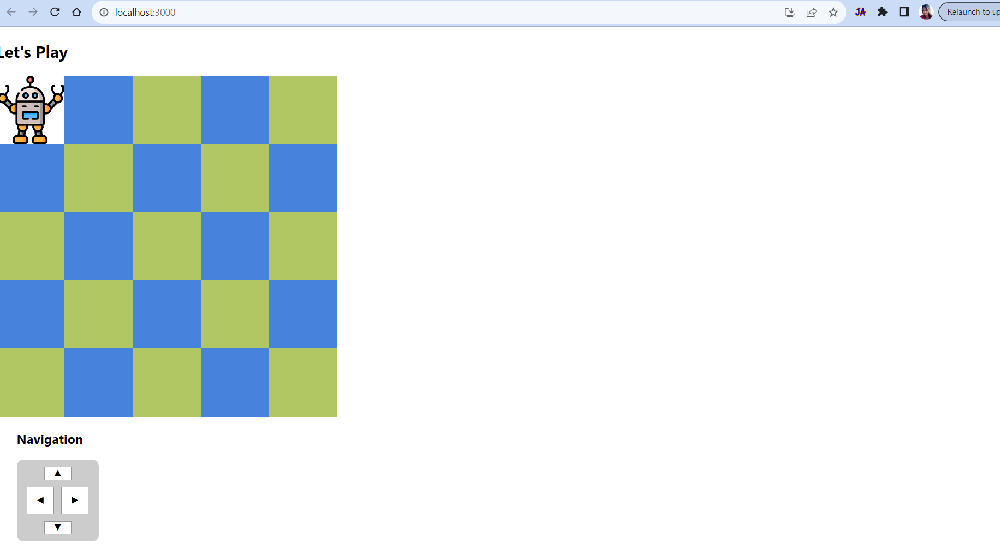

# Simple robot's movements

Description :
  The application is a simulation of a simple robot moving on a square table, of dimensions 5 units x 5 units. Initially, robot placed at the 1,1. There are no other obstructions on the table surface. The robot is free to roam around the surface of the table, it should not be fall from the table edge.Robot travels can move North, East, South or West by one unit at a time. There is a navigation buttons to make it possible.Clicking/tapping on a cell will teleport the robot to that cell. Robot will be able to travel in any direction using that method. But teleport is delay based on the distance the robot has to traval.

# Getting Started with Robot's Movement App

Clone or download as a zip file to your pc\
(https://git@github.com:ruchini/robot-move.git).

## Run the APP

Before run in the project directory, 
### `npm install`

then you can run:
### `npm start`

Runs the app in the development mode.\
Open [http://localhost:3000](http://localhost:3000) to view it in your browser.

The page will reload when you make changes.\
You may also see any lint errors in the console.

### `npm test`

Launches the test runner in the interactive watch mode.\

## Running Application UI
- 

- 

## Get the demo link

https://simple-robot-movement.netlify.app/
